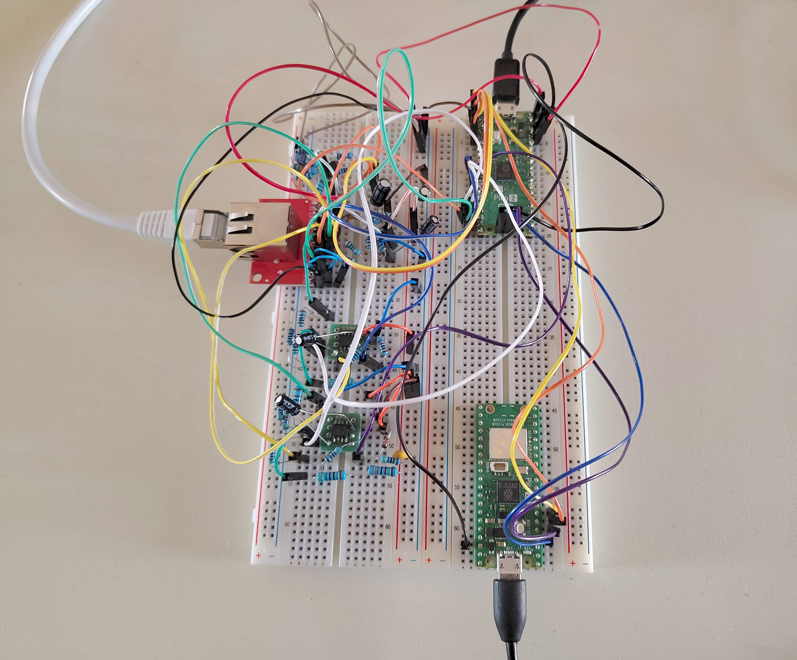
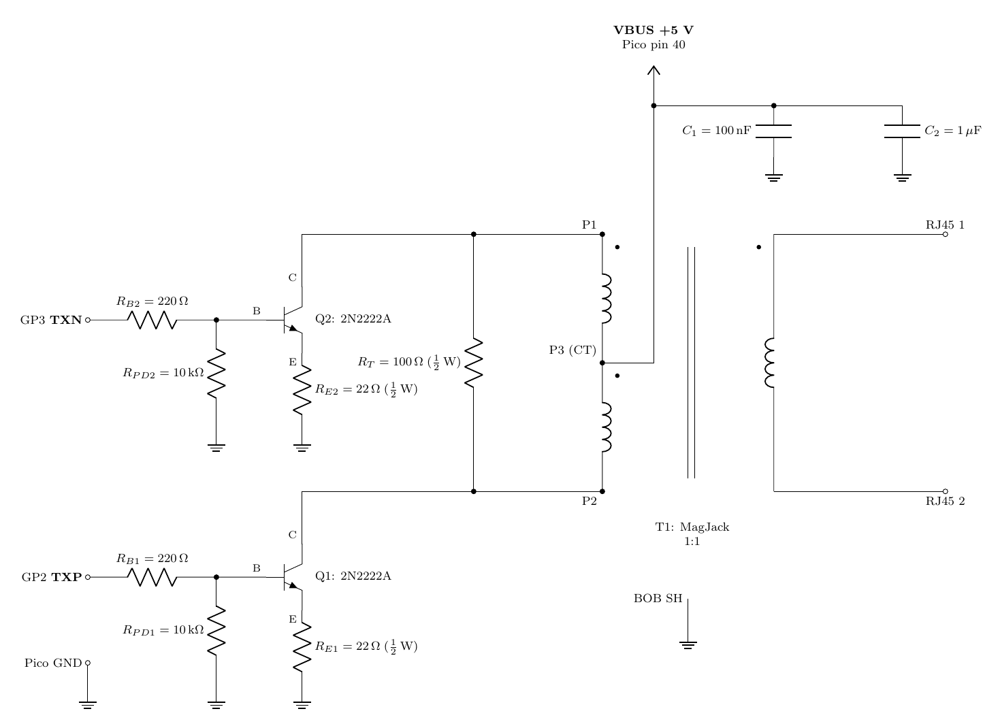
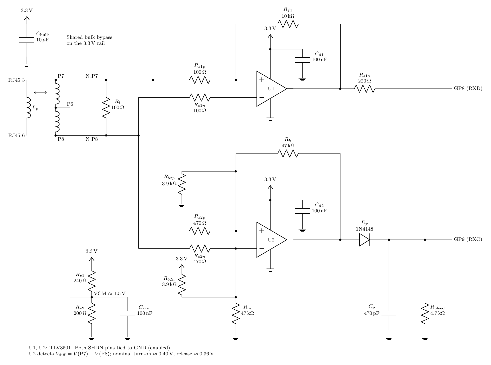
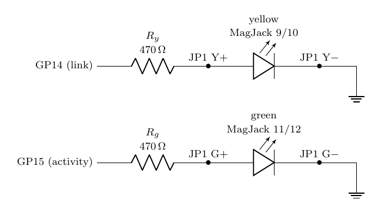

# Pico 2 Ethernet NIC Emulation

Technical demo of a 10BASE-T Ethernet NIC built on top of a Raspberry Pi Pico 2
(RP2350) microcontroller, presented to a Linux host via USB as a [CDC-NCM
device](https://en.wikipedia.org/wiki/Ethernet_over_USB).



# Motivation

This project started as a tech demo idea for a Raspberry Pi Pico 2 board
(RP2350 microcontroller), to showcase what could be done with PIO programming
and by using the various hardware blocks of the RP2350 in smart ways.
Simultaneously, it is meant as a showcase of best-practice firmware development
using C++23 and Bazel.

I intentionally avoided taking inspiration from existing projects, but I later
found that a few similar projects already existed for different kinds of
programmable microcontrollers, including the Pico 2. However my project has
always had its own independent design and it ended up reaching different and
stricter goals compared to the prior art I am aware of.

# Goals

* Compliant 10BASE-T Ethernet NIC, highest possible 10BASE-T speed over a USB
  1.1 link. Support for full-duplex and half-duplex with CSMA/CD.
* Own design and implementation of the PHY, no external hardware or software
  solution.
* Efficient implementation with minimal resources. Core 1 is completely unused,
  and so are PIO 1 and 2, 14 out of the 16 DMA channels, 3 out of 4 DMA
  interrupt lines, and most of the memory. There is room to comfortably run a
  non-trivial second application in parallel on the Pico.
* Quality firmware implementation following best practices.

# Status

- Waveform shaping is currently not implemented. There is no pre-emphasis,
  edges are sharper than needed, so harmonic content is likely higher than
  it should and might not respect EMI requirements.
- Tested on a ~30 m U/UTP Cat5e Ethernet cable. Not tested on a full 100 m
  cable run.
- No RX squelch of signals < 300 mV and > 585 mV and no standard-compliant
  noise rejection. Currently, only a squelch of signals < 400 mV is in place as
  part of the carrier detection mechanism.
- The mandatory jabber detection is not implemented. In practice, however,
  jabber cannot happen by design because the PIO stops when the buffer-sized
  DMA runs out.
- No detection nor correction for inverted RX polarity (not mandatory by the
  standard).
- RX is only gated by carrier detection and samples the signal without
  verifying its symbols, so it might not detect an invalid Manchester code.
- Support for VLAN-tagged frames and envelope frames is not implemented.
- PAUSE flow control is not implemented.
- Auto-negotiation support is partial, Next Page and Remote Fault are not
  implemented.
- USB suspension is not implemented.
- TinyUSB's CDC-NCM reports 12 Mbps connection speed (USB 1.1 full-speed)
  and currently it does not support reporting the actual 10BASE-T's 10 Mbps.
- No support to override the MAC address from host (TinyUSB limitation).

# Speed

In a nutshell, the measured speed is about 9 Mbps of Ethernet traffic, close to
the average theoretical maximum possible speed of CDC-NCM over USB 1.1 (~9.5
Mbps), and it is only capped by the host driver, not by the device nor
firmware.

## Theoretical limit

USB 1.1 full speed is 12 Mbps, so it cannot support a full-duplex 10BASE-T (20
Mbps of Ethernet traffic). And even in half-duplex, the attainable Ethernet
speed is limited by USB protocol overhead, and the additional CDC-NCM protocol
overhead on top of it.

At most 19 bulk packets can fit in a 1 ms USB frame. USB framing takes 15% of
the bits, plus another 3.9 % for start- and end-of-frame packets. This leaves
~9.73 Mbps of bulk USB payload.

CDC-NCM with 4-frame blocks of 6144 bytes consumes another 139 bytes of
overhead (header, table, padding), leaving ~9.59 Mbps of Ethernet frames, i.e.
~9.5 Mbps of Ethernet payload, or ~8.8 Mbps TCP traffic (with delayed ACK).

If USB bit stuffing is considered, however, the worst case goes down to 17 bulk
packets and 8.7 Mbps USB payload, for ~8.47 Mbps Ethernet payload, or ~7.88
Mbps TCP payload.

## Attained speed

The pico-ethernet firmware can sustain full speed, it is only limited by the
host-side driver (frames can be dropped if the driver does not feed TX frames
or drain RX frames fast enough). Testing on different USB controllers (even on
the same machine) consistently attained different speeds for this reason.

Connected to an ASMedia ASM1143 USB 3.1 controller, the pico-ethernet NIC
reached about 8.2 Mbps TX / 8.5 Mbps RX in half-duplex, and about 4.55 + 4.55
Mbps of simultaneous TX and RX in full-duplex (raw Ethernet speed).

The Ookla speed test for a connection flowing solely through the NIC attained
~7.7 Mbps download and ~7.27 Mbps upload speed (net of the full network stack
overhead). This is close to the theoretical maximum TCP speed of 7.9-8.8 Mbps
from above (which is a range rather than a single number because it depends on
the amount of bit stuffing required in the USB layer, which is
content-dependent).


# Hardware design

No hardware PHY solution is used, the PHY circuit is designed from the ground
with basic parts. It is built with a shielded MagJack module that only provides
RJ45 connector plus magnetics and a typical LED pair.

The TX circuit uses two transistors to drive the TX pair, with the collectors
powered from the 5V VBUS.



The RX circuit uses two comparators, one for differential signal decoding and
one for carrier detection (further filtered by an envelope detector composed of
a diode and an RC circuit).



LED wiring, for link state and link activity:



For prototyping, all the way to a fully functional version, the MagJack and
comparators are mounted on breakout boards, and the whole circuit is assembled
on a pair of 840-point breadboards: one breadboard for the front-end circuits,
and another one for the Pico 2 and a debug probe (development only, not part of
the project itself).

# Building

```bash
# Build the firmware for RP2350
bazelisk build --config=rp2350 //src:pico_ethernet_firmware

# Run host-based unit tests
bazelisk test //src/...
```

The build produces a UF2 image at `bazel-bin/src/pico_ethernet_firmware.uf2`.

# Checks

A pre-push script runs the checks locally:
```bash
./tools/pre_push.sh
```

The host unit tests can be run under sanitizers:

```bash
bazelisk test --config=asan  //src/...
bazelisk test --config=ubsan //src/...
bazelisk test --config=msan  //src/...
```

Additional checks:

```bash
bazelisk run   //tools/format:check
bazelisk run   //tools/format:fix
bazelisk build --config=rp2350 //tools/checks:no_alloc_gate
bazelisk build --config=rp2350 //tools/checks:binary_size_gate
```

## On-target tests

Binaries to test logic that is runnable on target platform only, e.g. TX and RX
PIO SMs, are provided. To execute them, build and flash, then check the results
over a UART console (e.g. via `minicom -D /dev/ttyACM0 -b 115200`):

```bash
bazelisk build --config=rp2350 //src/phy/test:rx_pio_selftest
bazelisk build --config=rp2350 //src/phy/test:tx_pio_selftest
bazelisk build --config=rp2350 //src/phy/test:csma_cd_selftest
bazelisk build --config=rp2350 //src/phy/test:autoneg_selftest
```

## Peer testing

Two tools are provided to test against a peer interface (on the same
development host).

`peer_flood_test.py` is the simpler one. It allows to produce a flood of frames
(using [Mausezahn](https://en.wikipedia.org/wiki/Mausezahn), which needs to be
installed and available in the `$PATH`).

```bash
uv run tools/peer_flood_test.py --help
```

`wire_test.py` allows to send traffic between peers, and verifies that frames
are correctly received.

```bash
uv run tools/wire_test.ph --help
```

Both tools allow to optionally show counters on host or device.

## Reading device statistics

The firmware exposes TX and RX statistics over the standard
`GET_ETHERNET_STATISTIC` control request (advertised via `bmEthernetStatistics`
in the Ethernet Networking Functional Descriptor).

Since no mainline Linux tool issues this request, a script to read the
statistics is provided (add a udev rule for VID:PID `1209:0001` to avoid the
need for root):

```bash
uv run tools/read_ethernet_stats.py
```

## Debugging

To build with debug symbols:
```bash
bazelisk build --config=rp2350 --copt=-g --strip=never //src:pico_ethernet_firmware
```

To attach a debugger on a running application (or potentially a crashed one),
e.g. using [Raspberry Pi pico's openocd
fork](https://github.com/raspberrypi/openocd):
```bash
openocd -f interface/cmsis-dap.cfg -f target/rp2350.cfg -c "adapter speed 5000"
```

Then connect a debugger (e.g. `gdb`) as usual, for example:
```
gdb bazel-bin/src/pico_ethernet_firmware \
  -ex "target extended-remote :3333" \
  -ex "bt" -ex "frame 2" -ex "info args" -ex "info locals" \
  -ex "p *ep" -ex "p/x *buf_reg" -ex "x/1xw 0x50110058"
```

## Credits

Most of the source code is LLM generated with a mix of models (GLM 5.3 and 5.2,
GPT-5.6-Sol and GPT-6-astra, Claude Opus 4.8).

## Disclaimer

This is a technical demo, and while it is developed following best engineering
practices and with significant effort on testing and validation, it remains
primarily a project for demonstration purpose. Do not consider it
production-ready, and use it solely at your own risk.

## License

This project is made available under a [MIT LICENSE](LICENSE).
